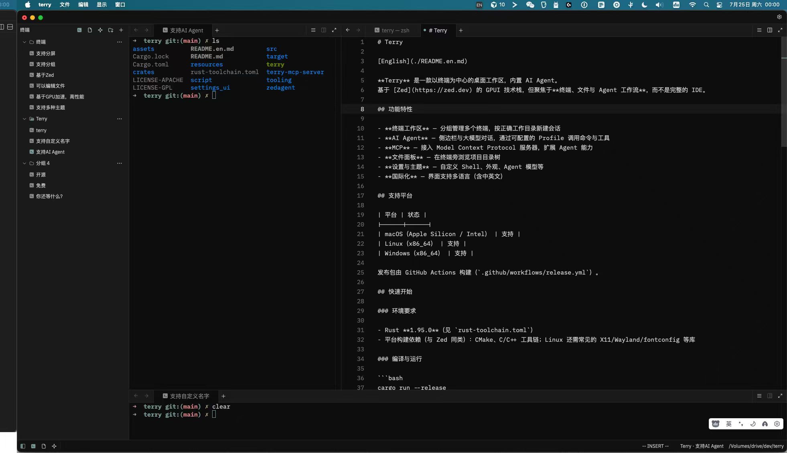
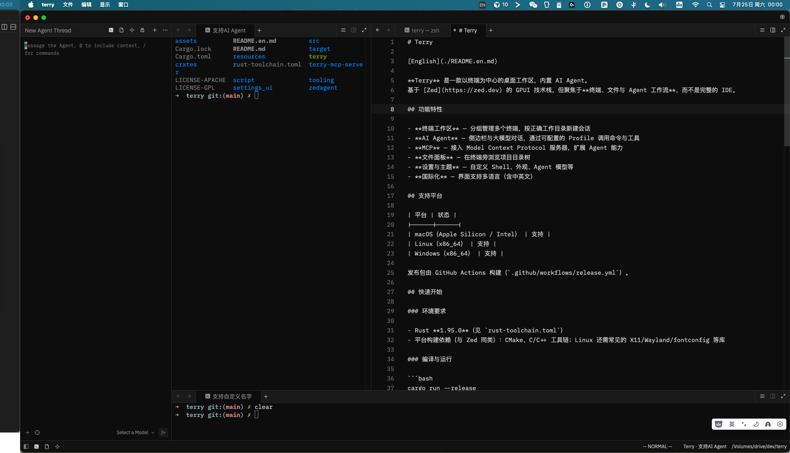
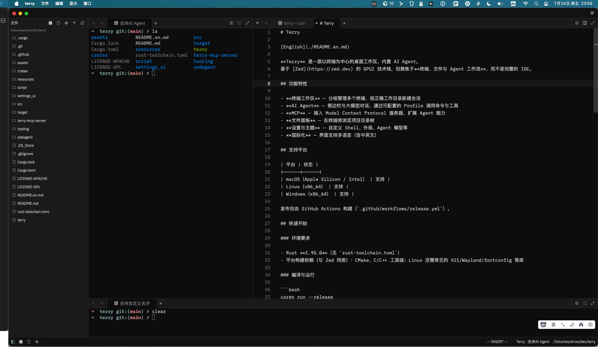

# Terry

[中文](./README.zh.md)

**Terry** turns your terminal into a workspace.  
Group shells, browse files, and keep an AI agent beside you — built for people who live in the command line.

## Preview

<p align="center">
  
</p>
<p align="center">
  
</p>
<p align="center">
  
</p>

## Features

- **Terminal workspace** — Group and manage multiple terminals; open new sessions with the right working directory; groups support automatic tiled layouts (manual / tall / grid / stack, like kitty); enable **broadcast input** in a group's context menu to type into every terminal at once (`ctrl-alt-b`)
- **Quake terminal** — A drop-down terminal summoned anywhere with `ctrl+\`` , docked to the top of the screen (macOS)
- **CLI** — Drive a running Terry from scripts and editors: `terry new-tab --cwd ~/src` and `terry send-text "cargo test"`
- **Terminal images** — kitty graphics protocol and sixel support for rendering images directly in the terminal, with animated GIFs (`chafa` / `viu` / `icat` work)
- **Terminal protocols** — kitty keyboard protocol (CSI u) and OSC 52 clipboard read/write
- **Shell integration** — automatic for zsh and fish: prompt marks (OSC 133 / VS Code OSC 633) and working-directory tracking (OSC 7); `ctrl-shift-up` jumps to the previous prompt
- **Link jump** — `Ctrl+Shift+E` lists all currently visible links (URL / path / OSC 8); pick one with the keyboard to open it
- **AI Agent** — Chat with LLMs in a side panel; run commands and tools with configurable profiles
- **MCP** — Connect Model Context Protocol servers to extend agent capabilities
- **Files panel** — Browse the project tree alongside your terminals
- **Editor** — Open text from the files panel, or with New File / Open File; files share tabs and splits with terminals. Vim mode is on by default, with in-file search and go to line. Markdown can be previewed, and images open in a viewer
- **Settings & themes** — Customize shell, appearance, agent models, and more
- **i18n** — UI strings available in multiple locales (including English and Chinese)

## Shell integration

Terry parses **OSC 133** prompt marks (including the VS Code **OSC 633** variant) and **OSC 7** working-directory reports. With integration active, `ctrl-shift-up` jumps to the previous prompt.

- **zsh and fish** work out of the box. Terry writes its integration scripts to its data directory (on macOS: `~/Library/Application Support/Terry/shell-integration`) and injects them automatically — no dotfile changes needed. Disable it with `"shell_integration": false` in the `terminal` section of your settings.
- **bash** is supported manually — add one line to `~/.bashrc`:

  ```bash
  [ -n "$TERRY_INTEGRATION_DIR" ] && . "$TERRY_INTEGRATION_DIR/bash/terry.bash"
  ```

  (Requires bash ≥ 4, the default on Linux.)

Remote shells launched as `ssh` are skipped, and task runs never get integration.

## CLI

A running Terry instance listens on a local IPC socket (token-protected; connection info in `terry/ipc.json` under your data directory). The `terry` binary doubles as the client:

```sh
terry new-tab --cwd ~/src          # open a new tab in the active window
terry send-text "cargo test"       # paste text into the active terminal
```

`send-text` pastes without executing — it never appends a newline.

## Command output

With shell integration active, Terry tracks each command's boundaries and exit code (`OSC 133;C/D`):

- `cmd-alt-u` (macOS) / `ctrl-alt-u` (Linux, Windows) copies the previous command's input and output to the clipboard
- The status bar shows the last failed command's exit code, e.g. `group · title · exit 1`
- Terminal search (`cmd-f`) has a case-sensitive toggle (`alt-cmd-c` on macOS, `alt-c` elsewhere)

## Platforms

| Platform | Status |
|----------|--------|
| macOS (Apple Silicon / Intel) | Supported |
| Linux (x86_64) | Supported |
| Windows (x86_64) | Supported |

Release packages are built via GitHub Actions (`.github/workflows/release.yml`).

## Getting started

### Prerequisites

- Rust **1.95.0** (see `rust-toolchain.toml`)
- Platform build deps: CMake, a C/C++ toolchain, and on Linux the usual X11/Wayland/fontconfig libraries

### Build & run

```bash
cargo run --release
```

Config and data live under the app name **Terry** (for example `~/.config/terry/` on Linux, `~/Library/Application Support/Terry` on macOS).

### Package locally

```bash
# macOS
script/package-macos.sh

# Linux
script/package-linux.sh

# Windows (PowerShell)
.\script\package-windows.ps1
```

Artifacts are written under `target/release/`.

## Project layout

```
src/                 # App entry, terminal/file panels, menus
crates/              # Shared libraries (GPUI, terminal, agent, settings, …)
agent_ui / crates/agent_ui
assets/              # Icons, default settings, themes
script/              # Packaging scripts
resources/           # App icons and desktop metadata
```

## License

- Application package: **GPL-3.0-or-later** (see `LICENSE-GPL`)
- Many crates retain their upstream licenses (including Apache-2.0; see `LICENSE-APACHE` and per-crate metadata)

## Contributing

Issues and pull requests are welcome. Please keep changes focused; match existing code style, and test on the platform you touch.
